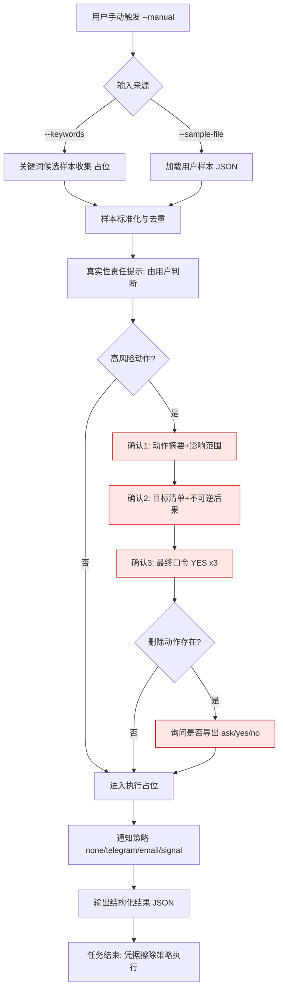

# holmes-cleanup 流程图（MVP / dry-run）

```mermaid
flowchart TD
  A[用户手动触发 --manual] --> B{输入来源}
  B -->|--keywords| C[关键词候选样本收集 占位]
  B -->|--sample-file| D[加载用户样本 JSON]
  C --> E[样本标准化与去重]
  D --> E

  E --> F[真实性责任提示: 由用户判断]
  F --> G{高风险动作?}
  G -->|否| K[进入执行占位]
  G -->|是| H[确认1: 动作摘要+影响范围]
  H --> I[确认2: 目标清单+不可逆后果]
  I --> J[确认3: 最终口令 YES x3]
  J --> L{删除动作存在?}
  L -->|是| M[询问是否导出 ask/yes/no]
  L -->|否| K
  M --> K

  K --> N[通知策略 none/telegram/email/signal]
  N --> O[输出结构化结果 JSON]
  O --> P[任务结束: 凭据擦除策略执行]

  classDef block fill:#ffe6e6,stroke:#cc0000,color:#333;
  class H,I,J,M block;
```

## 关键审计点
- 仅允许 `--manual` 触发（拒绝定时/后台）
- 高风险动作必须三次确认，缺一不可
- 删除前必须先走导出询问
- 通知由用户决定；未启用可不通知
- 凭据只读环境变量，不落盘，最小权限、最短 TTL、任务后擦除
